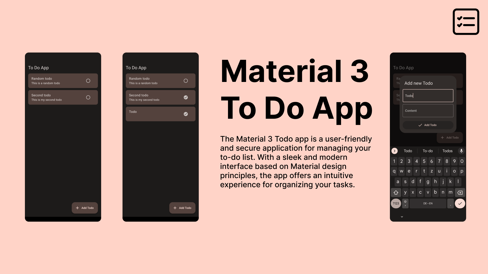

# To Do App

Tutorial: https://medium.com/@tommyyy/creating-a-material-3-to-do-app-with-flutter-aa07bb888395

### Packages used:
- dynamic_color: ^1.6.5
- flutter_slidable: ^3.0.0
- path_provider: ^2.0.15
- encrypt: ^5.0.1

Get it on Gumroad: https://tommyyy.gumroad.com/l/todos
